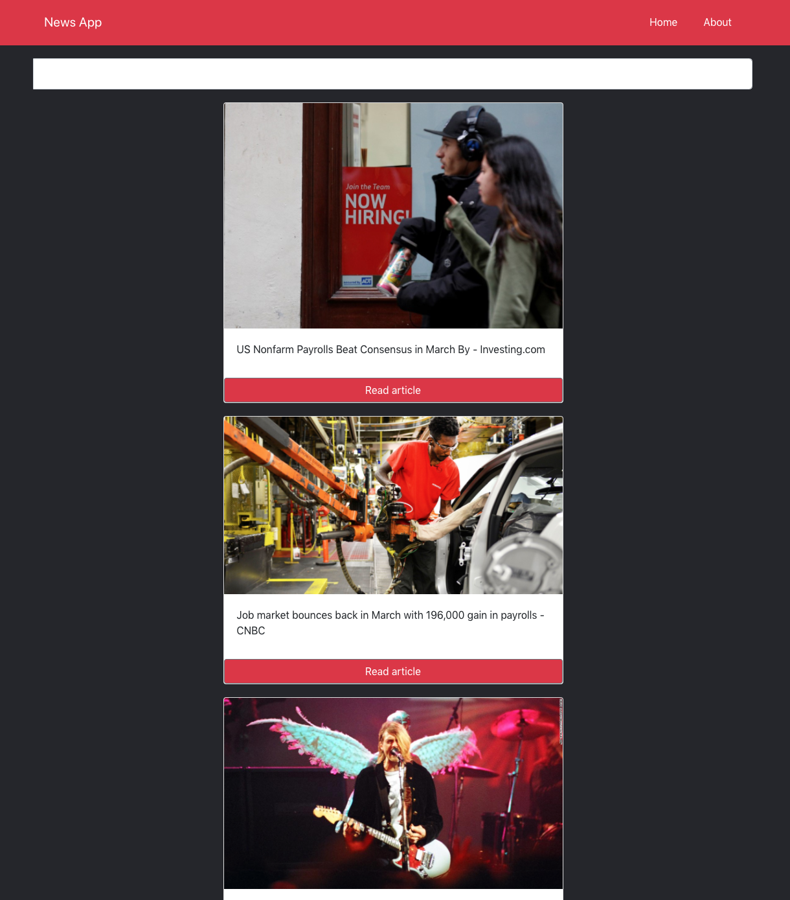

# news-react-demo-app

### Purpose of this app is for demonstrating React concepts during a workshop

#### Slides from the workshop are located in "docs/slides" folder
Requirements

- latest version of node and npm

### How to run

cd into root folder of the app and run commands:

```javascript
npm install
npm start
```

### Api url:

```javascript
https://mysterious-savannah-50993.herokuapp.com/news
```




